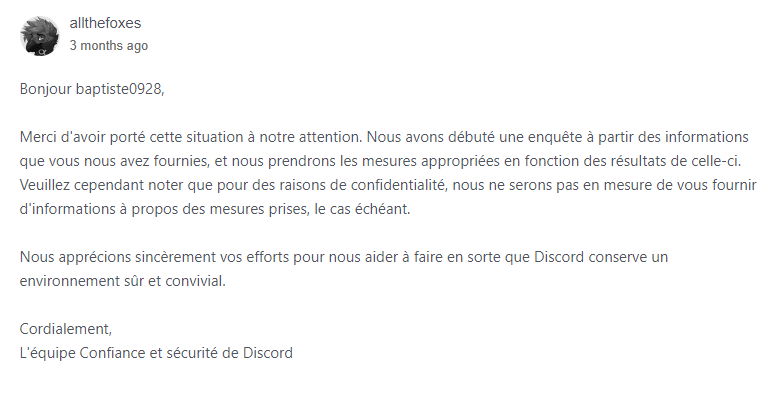

Signaler une infraction à Discord
Vous avez rencontré un utilisateur malintentionné sur Discord ? Signalez-le afin que ce dernier soit sanctionné.

Sur Discord, certains utilisateurs n'ont pas forcément de bonnes intentions. Si ces derniers ont un comportement particulièrement néfaste pour la communauté, il est recommandé de **le signaler à l'équipe Confiance & Sécurité de Discord**. Si l'infraction s'avère véridique, l'utilisateur risque des sanctions allant de l'avertissement à la suppression de compte. 😖 

## 🧐 Quels types d'infractions signaler ?

Bien évidemment, tous les types d'infractions ne sont pas passibles d'une suppression de compte. Les comportements punissables sont décrits dans **la [Charte Communautaire](https://discord.com/guidelines) de Discord** (ainsi que dans les [Conditions d'Utilisation](https://discord.com/terms), mais il s'agit plus d'un charabia juridique de de véritables consignes claires). La liste des types de rapports de la page de signalements est un très bon résumé pour ceux réticents à la lecture.

En règle générale, les comportements **nocifs pour la communauté** (spam, promotion de contenu illégal, etc.) ou d'**atteinte grave à un utilisateur** (doxxing, harcèlement) sont à signaler.

Pour les comportements moins extrêmes, **privilégiez le bannissement** (sur un serveur) ou le [blocage](https://support.discordapp.com/hc/fr/articles/217916488-Blocage-et-param%C3%A8tres-de-confidentialit%C3%A9) (sur tout Discord). Si vous n'êtes pas modérateur sur le serveur où se déroulent les actes, n'hésitez pas à le signaler à l'équipe de modération de ce dernier, qui se doit d'agir.

## 🕵️ Récupérer les preuves

Pour effectuer un signalement, il vous faut des preuves à fournir. Tout d'abord, notez bien que les **captures d'écran ne servent à rien**, elles sont très facilement falsifiables. Il vous faudra obligatoirement un (ou plusieurs, c'est encore mieux) liens de messages.

**Ces fameux liens sont très faciles à obtenir**. Sur un message correspondant à l'infraction que vous souhaitez signaler, faites Clic droit > Copier le lien du message (sur ordinateur) ou Appui long > Partager > Copier dans le presse-papier (sur mobile). 

## 📪 Signaler l'infraction à l'équipe _Confiance & Sécurité_

Un signalement est très facile à effectuer et prend seulement quelques minutes. Tout d'abord, rendez-vous sur le **formulaire dédié** en suivant le lien **https://dis.gd/report**.

### Formulaire de signalement à l'équipe Confiance & Sécurité

En fonction du type de rapport choisi, **différentes informations seront demandées**. Renseignez le lien du message récupéré à l'étape précédente au bon endroit (et éventuellement les autres dans la description). N'hésitez pas à être **le plus exhaustif possible** et n'oubliez pas les règles élémentaires de politesse ! 😇 

### 📨 La réponse de Discord

Quelques jours après votre signalement - en général en moins d'une semaine - vous devrez recevoir **une réponse par e-mail** de la part de Discord. Notez bien que vous ne serez pas en mesure de connaitre les sanctions prises (ou non) contre l'utilisateur signalé. 😒

