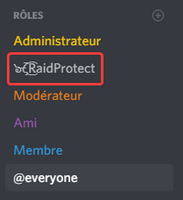

import DocCard from '@theme/DocCard';

Besoin d'aide pour utiliser RaidProtect ? Vous trouverez toutes les informations dans notre documentation !

Bienvenue sur la documentation de RaidProtect !
Cette documentation a pour but de vous expliquer le fonctionnement de RaidProtect. N'hésitez pas à nous faire parvenir vos commentaires afin que nous pussions l'améliorer.

N'oubliez pas de rejoindre notre serveur Discord pour **être informé des nouveautés sur le projet**. Vous pourrez également contacter notre équipe de support qui répondra à vos questions sur l'utilisation du bot. 😄 

## 🚀 Débuter avec RaidProtect

Pour commencer à utiliser RaidProtect, il vous suffit de **l'inviter sur votre serveur** en utilisant le lien suivant. Attention, des copies circulent, invitez-le uniquement depuis notre site officiel.

:::note
Afin d'assurer son bon fonctionnement, accordez bien la permission **Administrateur** à RaidProtect. Cela lui permet de modérer automatiquement tous vos salons.

N'oubliez pas également de **placer son rôle au niveau de celui des administrateurs** de votre serveur (voir image). Le système de permissions ne permet pas à RaidProtect de sanctionner les utilisateurs ayant un rôle au dessus de lui.

:::

Ça y est, **RaidProtect est sur votre serveur Discord** ! Un salon @Mapidae`#raidprotect-logs` a été créé. Ne le supprimez pas, il est nécessaire au fonctionnement du bot. Si vous avez déjà un salon de logs, changez celui de RaidProtect avec la commande `?settings logs #nouveau-salon`.  

:::note
**Si le salon de logs ne s'est pas créé de lui-même**, il sera nécessaire d'effectuer la commande `?setup` dans votre serveur pour l'initialiser manuellement le bot.
:::

Consultez les différentes parties de cette documentation pour **découvrir toutes les fonctionnalités offertes** par le bot ! 😎 

<DocCard item={{ type: 'link', href: '/features/antispam', docId: 'features/antispam', label: 'Anti-spam' }} />
<DocCard item={{ type: 'link', href: '/features/captcha', docId: 'features/captcha', label: 'Captcha (vérification)' }} />
<DocCard item={{ type: 'link', href: '/features/raidmode', docId: 'features/raidmode', label: 'Mode raid' }} />
<DocCard item={{ type: 'link', href: '/features/others', docId: 'features/others', label: 'Autres' }} />

Pour les moins téméraires (ou les plus pressés), vous pouvez consulter notre guide rapide qui récapitule les principales informations à savoir pour débuter. 😉 

<DocCard item={{ type: 'link', href: '/quick-guide', docId: 'quick-guide', label: 'Guide rapide' }} />

## 👥 À propos du projet

RaidProtect est un projet gratuit et communautaire né en juillet 2018. Créé par [baptiste0928](https://baptiste0928.net/), le projet a rapidement conquis un grand nombre d'utilisateurs, et compte désormais une quinzaine de bénévoles, notamment pour le support utilisateur.