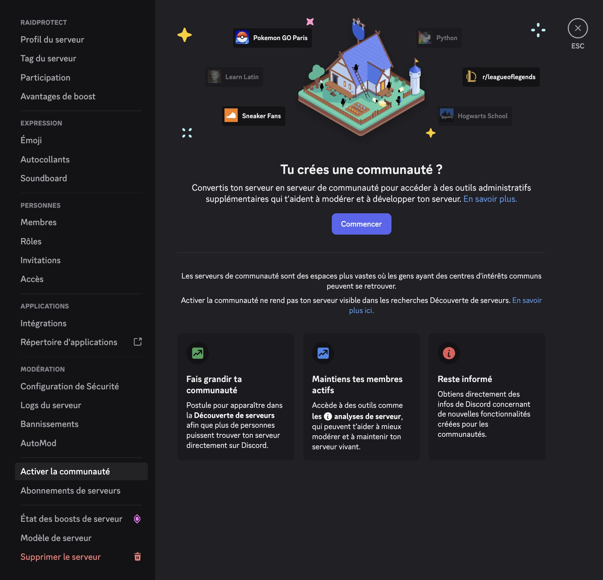

L’activation de la communauté rend disponibles plusieurs réglages de sécurité avancés indispensables au bon fonctionnement de certaines fonctionnalités de RaidProtect comme **DM Lock** ou le **Mode raid**.

## 🚦 Prérequis {#requirement}

- Être administrateur du serveur Discord.

## 🚩 Activer la communauté {#steps}

1. **Ouvrez les paramètres de votre serveur**
   - Cliquez sur le nom du serveur en haut à gauche > “Paramètres du serveur”.

2. **Accédez à la section “Communauté”**
   - Dans la barre latérale, rendez-vous dans l’onglet **Activer la communauté** puis cliquez sur **Commencer**.

:::note
Si la communauté est déjà activée sur votre serveur, la section s'appellera **Vue d'ensemble de la communauté**.
:::

3. **Suivez l’assistant d’activation**
   - Activez la vérification par e-mail pour tous les membres.
   - Activez le filtre du contenu explicite.
   - Configurez un salon de règles et un salon d’annonces.
   - Accepter la charte d'utilisation des serveurs de communauté.

4. **Terminez la configuration**
   - Cliquez sur “Terminer la configuration”. Le badge “Communauté” s’affichera sur votre serveur une fois l’activation finalisée.

## 💡 Utiliser les modules DM Lock & Mode raid après activation {#use}

- Lancez la commande [`/settings`](../setup.md#settings) pour ouvrir le menu de configuration RaidProtect.
- Activez ou désactivez les modules souhaités (DM Lock, Mode raid…) depuis le menu interactif.