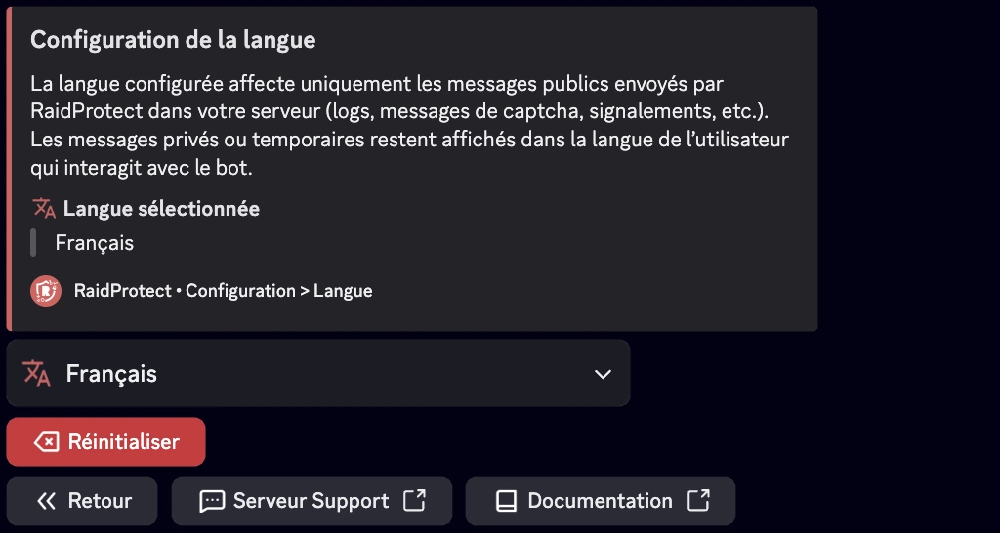

RaidProtect vous permet de choisir la langue utilisée par le bot pour s’adapter au mieux à votre communauté Discord.

:::note
Si votre serveur est défini comme communautaire (paramètre Discord), RaidProtect utilise par défaut la langue configurée dans les **paramètres de la communauté** du serveur.
:::

**Messages publics :** La langue configurée affecte uniquement les messages publics envoyés par RaidProtect dans votre serveur (logs, messages de captcha, signalements, etc.).

**Messages éphémères :** Ces messages privés ou temporaires restent affichés dans la langue de l’utilisateur qui interagit avec le bot.

## 🌐 Liste des langues supportées  {#supported}

- **Français**
- **Anglais**

## ⚙️ Changer la langue du bot {#change}

- Faites la [commande `/settings`](./setup.md#settings).
- Sélectionnez le bouton “**Langue**”.
- Sélectionnez la langue souhaitée.

Une fois la langue sélectionnée, le bot adaptera automatiquement tous ses messages, notifications et commandes à la langue choisie pour votre serveur.

:::info
Le support linguistique de RaidProtect est en constante évolution ! [Suggérez](https://suggestions.raidprotect.bot) les langues que vous souhaitez voir sur le bot ou [votez](https://suggestions.raidprotect.bot) pour les langues proposées afin de les voir ajoutées.
:::