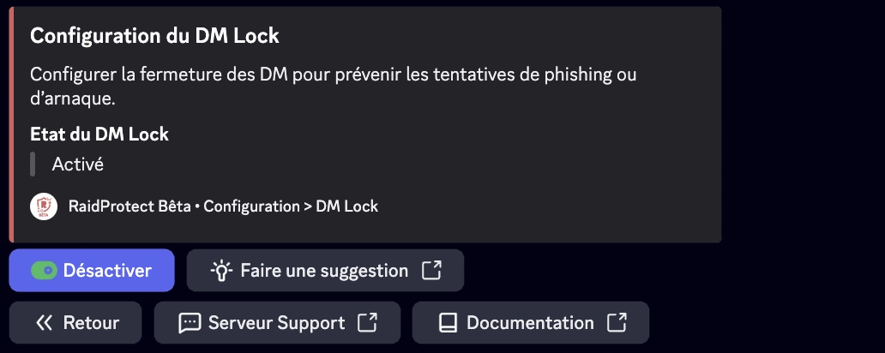

La fonctionnalité **Fermeture des MP** de RaidProtect permet de fermer l’accès aux messages privés (MP) envoyés depuis le serveur de façon permanente, surpassant ainsi la limitation native de Discord qui ne permet ce blocage que pour 24 heures via l'action de cybersécurité "Mettre les MP en pause".

## 🚦 Cas d’usage et recommandations {#recommendations}

- **Serveurs exposés au spam ou au harcèlement :** La Fermeture des MP est particulièrement recommandé pour les communautés publiques ou à forte audience, où les risques d’abus par MP sont accrus.
- **Événements temporaires ou périodes sensibles :** Lors de lancements, annonces importantes, ou périodes de forte affluence (ex. : concours, promotions), activer la Fermeture des MP permet de prévenir les tentatives de phishing ou d’arnaque.
- **Communautés avec un jeune public :** Pour les serveurs comptant un grand nombre de mineurs, limiter les MP peut renforcer la sécurité et prévenir les comportements inappropriés.
- **Protection continue :** Grâce à l’automatisation, il n’y a pas de fenêtre de vulnérabilité liée à l’oubli du renouvellement manuel.

## ❓ Fonctionnement de la Fermeture des MP {#working}

Le bot RaidProtect vérifie régulièrement l’état du paramètre de blocage des MP serveur et, si nécessaire, le réactive automatiquement afin d’éviter toute période de vulnérabilité entre deux renouvellements manuels. Cette tâche s’exécute de manière transparente pour les administrateurs et les membres du serveur.

:::info
Il reste possible d'envoyer et de recevoir des messages avec :
- ses amis
- les bots
- le staff
:::
:::warning
Les fonctions communautaires de Discord sont indispensables au bon fonctionnement de la Fermeture des MP. [Suivez notre guide pour vérifier l'activation de la communauté sur votre serveur.](../guides/community.md)
:::

## 🚩 Configuration de la Fermeture des MP {#config}

1. Faites la [commande `/settings`](../setup.md#settings).
2. Cliquez sur le bouton “**Fermeture des MP**”.
3. Activez ou désactivez la fermeture automatique des messages privés.

